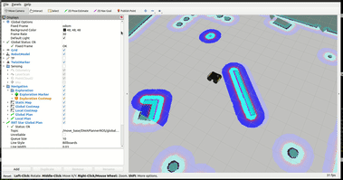

# `parallel-curves`
[](https://github.com/aforechi/parallel_curves/actions/workflows/action-ros.yaml)


<p float="left">
  
</p>

## Parallel Curves Path-Planning

This is a ROS Global (Path) Planner Plugin that implements the Parallel Curves path planning algorithm.

```
cd ~/ws/src   
git clone https://github.com/aforechi/parallel_curves.git
cd ..
colcon build
```

## Andino Robot Simulator

If you decided to test this plugin using Andino Robot Simulator you can install it with the following instructions:

```
$ cd ~/ws/src
$ git clone https://github.com/Ekumen-OS/andino.git
$ cd ..
$ colcon build
$ rosdep install --from-paths src --ignore-src -i -y
$ source install/setup.bash
```


## Running the Plugin on the Andino Robot using Gazebo Simulator**

In order to load this plugin you have to change the default value of "plugin" to "parallel_curves/ParallelCurvesRos" in the configuration YAML file of the navigation planners *nav2_params.yaml* you should insert the parameters values of the new planner:

```
<!-- File nav2_params.yaml -->
<!-- ~/ws/src/andino_navigation/params/nav2_params.yaml -->
planner_server:
  ros__parameters:
    expected_planner_frequency: 20.0
    plugins: ["GridBased"]
    use_sim_time: True
    GridBased:
      plugin: "parallel_curves/ParallelCurvesRos"
      tolerance: 0.5
      allow_unknown: true
      line_splits: 2
```

**3. Testing the planner with Gazebo Simulator and Rviz**

In three separate terminals, execute these three launch commands:

```
. /usr/share/gazebo/setup.bash
 ros2 launch andino_navigation andino_simulation_navigation.launch.py 
```

To test the plugin just click on "2D Nav Goal" button (at the top) and choose a goal location. You can now see that path generated by this planner (in green) and the robot moving to its goal if everything is fine.

## Unit Tests
Launch the tests verification:

```
colcon test 
colcon test-result --all
```

## Errors and Issues

If you find some error or issue, please create a new issue and help me to improve this package.

## Citation

If you use the navigation algorithm from this repository, please cite this work in your papers!

 - A. Baumgarten, L. Resendo, A. Forechi. [**Parallel Curves Path Planning Based on Tangent Segments to Concentric Curves**](https://arxiv.org/abs/). The 6th Iberian Robotics Conference (ROBOT2023), 2023.
 
 ```bibtex
 @InProceedings{baumgarten2023,
   title = {Parallel Curves Path Planning Based on Tangent Segments to Concentric Curves},
   author = {Baumgarten, Alysson and Resendo, Leandro and Forechi, Avelino},
   year = {2023},
   booktitle = {The 6th Iberian Robotics Conference (ROBOT2023)},
   url = {https://github.com/aforechi/parallel_curves},
   pdf = {https://arxiv.org/abs/}
 }
```
